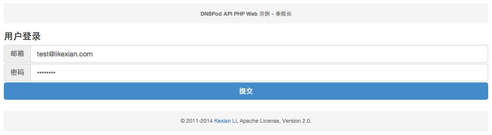
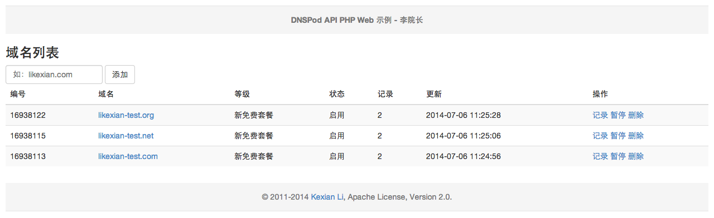
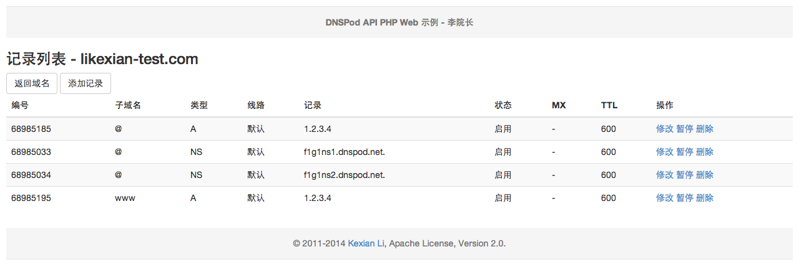
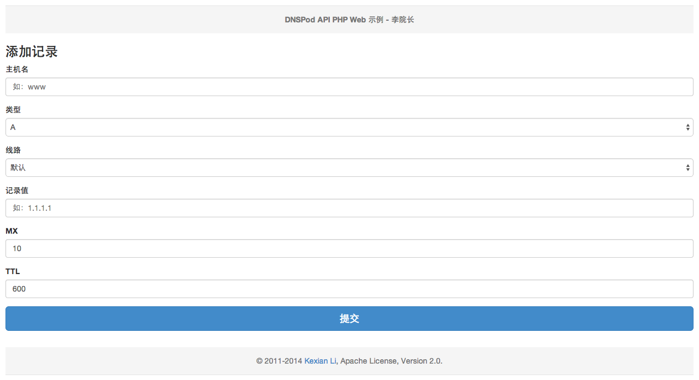
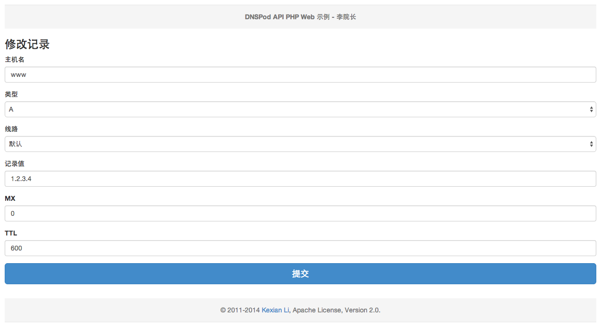
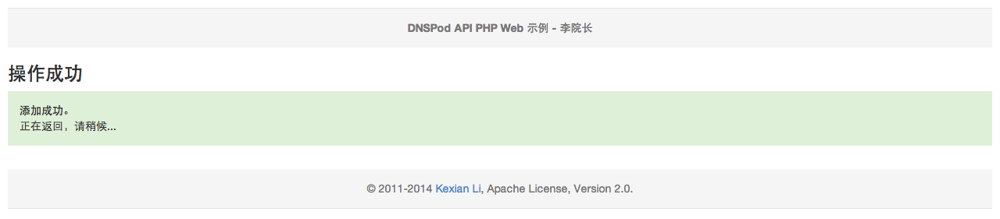
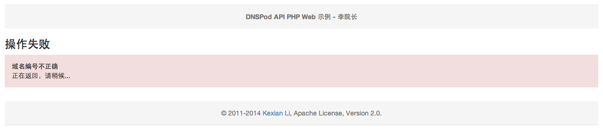

# DNSPod API PHP Web 示例

## DEMO 图片

### 用户登录

### 域名列表

### 记录列表

### 添加记录

### 修改记录

### 操作成功

### 操作失败

## LICENSE

Copyright 2011-2020 Li Kexian

Licensed under the Apache License 2.0

## About

- [Li Kexian](https://www.likexian.com/)
