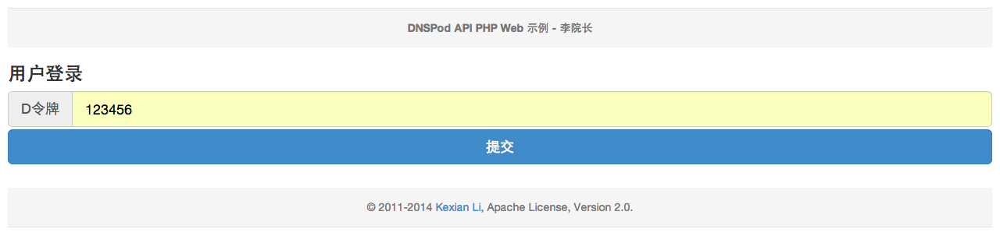

# DNSPod API PHP Web 示例

## 与我联系
- [李院长](http://github.com/likexian)
- [http://www.likexian.com/](http://www.likexian.com/)

## DEMO 图片

### 用户登录

### 域名列表

### 记录列表

### 添加记录

### 修改记录

### 操作成功

### 操作失败

### 输入D令牌

